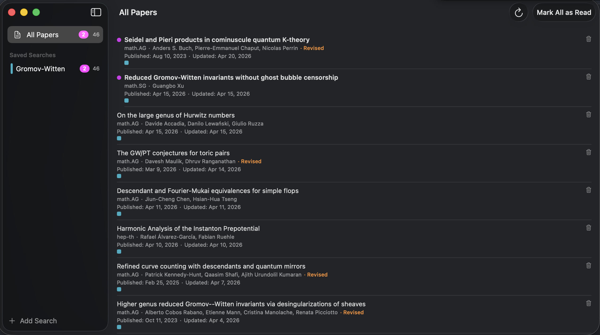
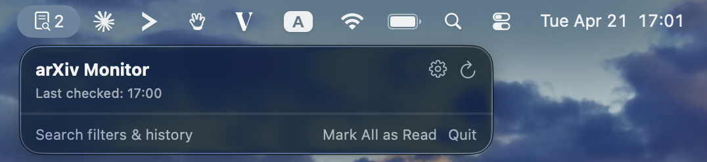
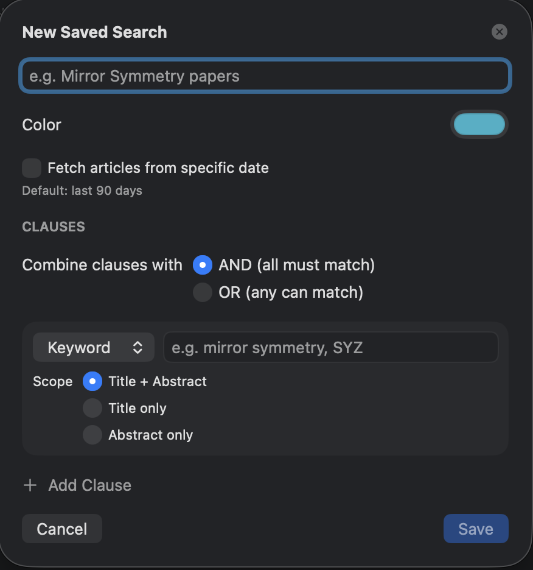
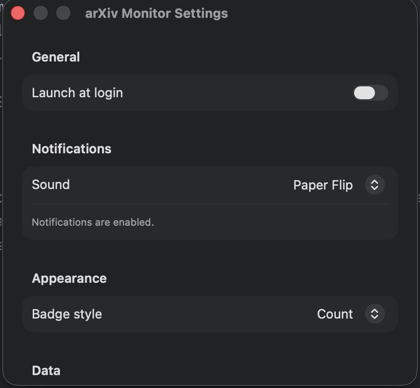

# arXiv Monitor


Stay on top of new [arXiv.org](https://arxiv.org) papers without leaving your menu bar. arXiv Monitor runs saved searches on a schedule and pings you with a native macOS notification the moment something relevant shows up -- so you never have to remember to check again.

Built with SwiftUI. Zero external dependencies -- Apple frameworks only. Requires macOS 13+.

## Screenshots

<p align="center">
  
  <br><sub><em>Main window — sidebar of saved searches, matched papers on the right.</em></sub>
</p>

<table>
  <tr>
    <td align="center" width="50%">
      <br>
      <sub><em>Menu-bar popover — new papers at a glance.</em></sub>
    </td>
    <td align="center" width="50%">
      <br>
      <sub><em>Menu-bar icon with unread badge.</em></sub>
    </td>
  </tr>
  <tr>
    <td align="center" width="50%">
      <br>
      <sub><em>Add/Edit Search sheet — clauses, scopes, color.</em></sub>
    </td>
    <td align="center" width="50%">
      <br>
      <sub><em>Settings — notifications, badge style, launch at login.</em></sub>
    </td>
  </tr>
</table>


## Quick start

Open `ArXivMonitor.xcodeproj` in Xcode 15+, select the `ArXivMonitor` scheme, and hit Run. That's it -- no package manager, no external dependencies. See [Building](#building) below for the command-line equivalent.

## Features

### Saved Searches

Create independent saved searches to monitor arXiv for specific topics. Each search consists of one or more clauses combined with AND/OR logic:

- **Keyword** -- match against title, abstract, or both. Comma-separated values are ORed (e.g. `mirror symmetry, SYZ`); space-separated words within one value are ANDed (e.g. `osculating elements` finds papers containing both words anywhere in the chosen scope, matching arXiv's website search behavior). Wrap a value in literal double-quotes (e.g. `"mirror symmetry"`) to force an exact-phrase match instead.
- **Category** -- filter by arXiv category. Comma-separated values are ORed (e.g. `math.AG, hep-th, math.SG`)
- **Author** -- search by author name

Examples:
- Gromov-Witten (keyword in title + abstract -- hyphenated terms are auto-quoted to defeat Lucene's NOT operator)
- `mirror symmetry, SYZ` in categories `math.AG, hep-th, math.SG` (keyword AND category, with multiple values ORed within each)
- cs.LG papers by Hinton (category AND author)
- "flow matching" in title (keyword, title only)

### Configurable Date Filtering

- Each search has a configurable "Fetch from" date -- defaults to 90 days ago
- "All time" option available for fetching complete history
- Pagination support: automatically fetches all matching results beyond the 100-result API limit
- Progress indicator shows pagination status during multi-page fetches

### Menu Bar Integration

- Lives in the macOS menu bar with a paper icon
- Badge shows unread paper count (configurable: count, dot, or hidden)
- Click to open a popover showing new papers at a glance
- Quick actions: refresh, open settings, dismiss all, open full window

### Full Window

- **Sidebar** with "All Papers" and individual saved searches
- **Paper list** showing matched papers sorted by update date
- Unread count badges (purple) and total count for each search
- Color-coded search filters with a colored stripe in the sidebar
- Colored square badges on each paper showing which searches matched it
- "Mark All as Read" button (works per-search or globally)
- Manual refresh button

### Paper Details

Each paper row displays:
- Title (bold if unread, with a purple dot indicator)
- Primary arXiv category
- Author list
- "Revised" tag (orange) for papers updated after initial publication
- Published and updated dates
- Colored badges for matching searches
- **Trash** button to move papers to trash (soft-delete, revertable)
- **Right-click context menu** with "Mark as Read" / "Mark as Unread" toggle
- Click title to open on arXiv

### Search Management

- **Edit** searches via context menu -- change name, clauses, color, or combine operator
- **Warning dialog** when editing clauses: "Changing search criteria will remove existing results for this search. Continue?"
- **Pause/Resume** searches via context menu -- paused searches are skipped during fetch cycles but retain existing papers (shown dimmed with a pause icon)
- **Delete** searches via context menu (removes associated papers)
- **Color assignment** -- each search gets an auto-assigned color from a built-in palette, editable via the color picker in the search editor

### Notifications

- Native macOS notifications for new and revised papers
- Configurable notification sound (custom paper-flip sound, system default, or none)
- First-run searches show papers as new in the UI but suppress notification flooding

### Background Monitoring

- Automatic fetch scheduling via `PollScheduler`
- Catches up on missed checks after wake from sleep
- 3-second delay between API calls to respect arXiv rate limits
- Launch at login option

### Trash

- Dismissing a paper moves it to trash instead of permanently deleting it
- Trashed papers are hidden from all views and won't trigger re-fetch
- Papers can be restored from trash

### Data Persistence

- Saved searches and paper history stored in a JSON file (`data.json`) in the app's sandboxed Application Support directory
- Atomic file writes prevent data corruption
- Papers are kept forever once fetched (no automatic pruning)
- Settings (sound, badge style, launch at login) stored in UserDefaults

### Export & Backup

- **Manual export**: Export all data (searches, papers, read/unread state) to a JSON file via Settings
- **Automatic backup**: The app automatically backs up `data.json` every 7 days to a `backups/` directory within Application Support
- Keeps the last 4 backups (~1 month of coverage)
- Backups are created on app launch if 7+ days have passed since the last one

### Testing

- Unit tests for URL query building, XML parsing, search model equality, app state operations (trash, restore, mark read/unread, backup)
- E2E UI tests covering settings, search management, data display, and sidebar functionality
- Launch with `--sample-data` flag to populate with test data

## Architecture

```
ArXivMonitor (Xcode project, single macOS target)
├── Models/
│   ├── SavedSearch.swift        -- Search model (clauses, color, pause state)
│   └── MatchedPaper.swift       -- Paper metadata
│
├── ArXivMonitorApp.swift        -- App entry point, MenuBarExtra
├── AppState.swift               -- Observable app state, persistence, fetch cycle
├── Services/
│   ├── ArXivAPIClient.swift     -- Fetch + parse arXiv Export API (Atom XML)
│   ├── XMLAtomParser.swift      -- Parse Atom 1.0 XML into MatchedPaper structs
│   ├── PollScheduler.swift      -- Periodic fetch scheduling
│   └── NotificationService.swift -- macOS notification delivery
├── Views/
│   ├── MenuBarPopover.swift     -- Main popover (paper list, badge)
│   ├── PaperRowView.swift       -- Single paper row
│   ├── MainWindowView.swift     -- Full window: sidebar + paper list
│   ├── SearchListView.swift     -- Saved search list (sidebar)
│   ├── PaperListView.swift      -- Paper list for selected search
│   ├── AddSearchSheet.swift     -- Add/edit saved search modal
│   └── SettingsView.swift       -- App preferences
└── Resources/
    └── paper-flip.aiff          -- Custom notification sound
```

## Building

Open `ArXivMonitor.xcodeproj` in Xcode 15+ and build the `ArXivMonitor` scheme, or from the command line:

```bash
xcodebuild -project ArXivMonitor.xcodeproj -scheme ArXivMonitor -configuration Release build
```

## Data Storage

| What | Where |
|------|-------|
| Paper history + saved searches | `~/Library/Containers/com.arxivmonitor.app/Data/Library/Application Support/ArXivMonitor/data.json` |
| Automatic backups | `~/Library/Containers/com.arxivmonitor.app/Data/Library/Application Support/ArXivMonitor/backups/` |
| Settings (sound, badge, launch) | UserDefaults (`com.arxivmonitor.app`) |

To reset the app to a clean state:

```bash
rm ~/Library/Containers/com.arxivmonitor.app/Data/Library/Application\ Support/ArXivMonitor/data.json
defaults delete com.arxivmonitor.app
```
